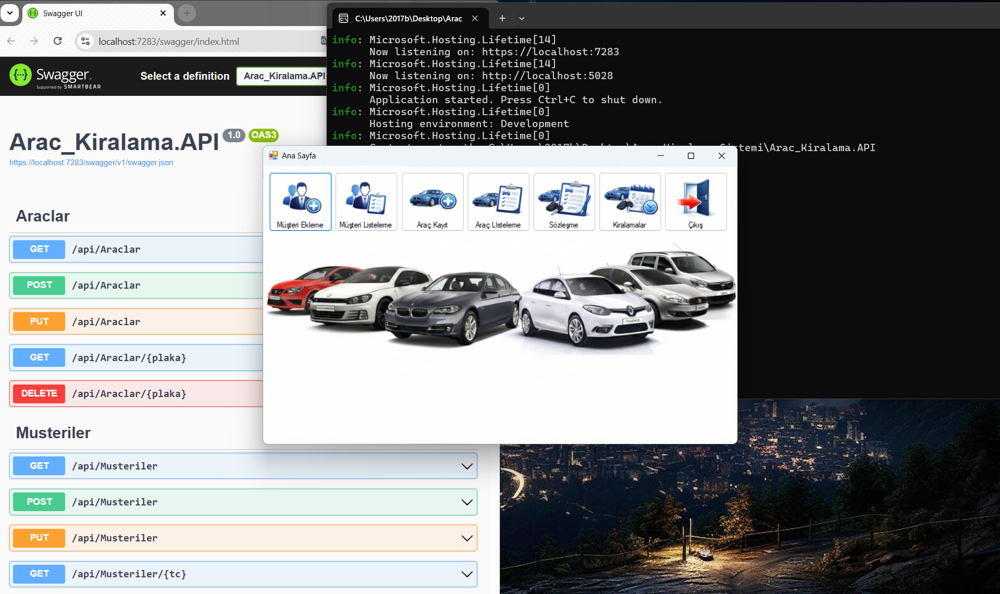
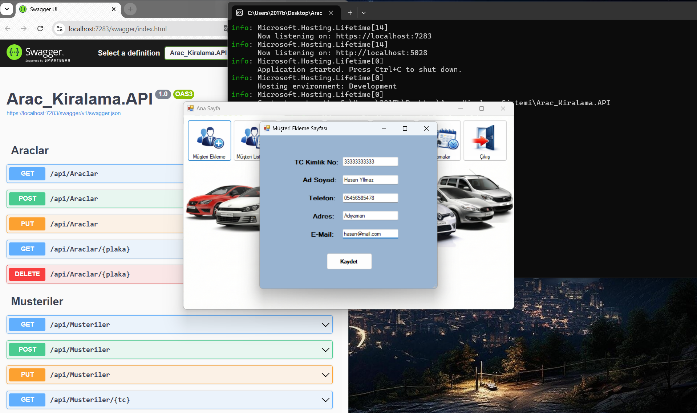
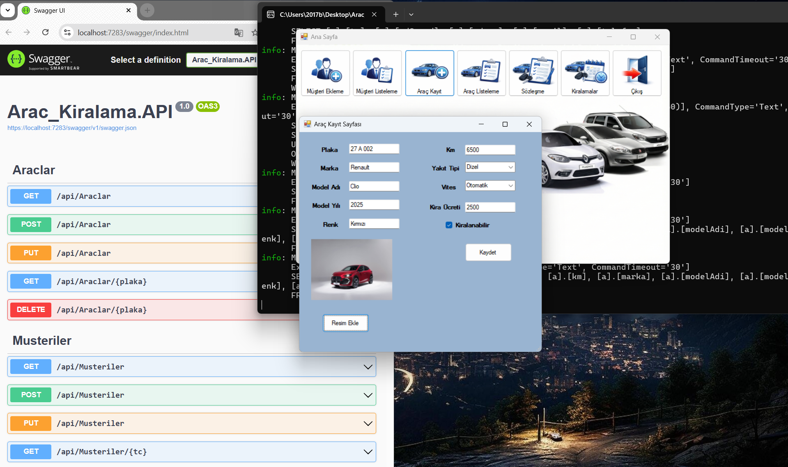
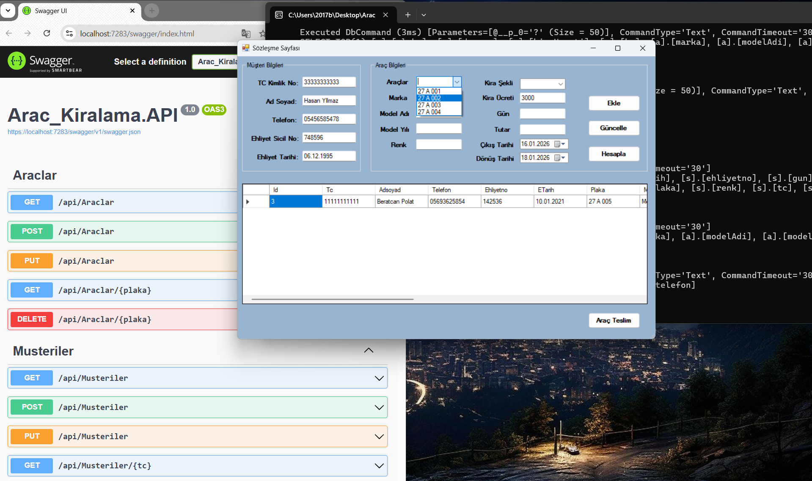

# 🚗 Araç Kiralama Sistemi (Car Rental System)

Bu proje, modern bir araç kiralama sürecini dijitalleştirmek amacıyla geliştirilmiş kapsamlı bir otomasyon sistemidir. **C#** programlama dili kullanılarak, **N Katmanlı Mimari** (N-Tier Architecture) prensiplerine uygun olarak tasarlanmıştır.

Proje, güçlü bir **ASP.NET Core Web API** arka ucu ve kullanıcı dostu bir **Windows Forms (WinForms)** masaüstü arayüzünden oluşmaktadır.

---

## 📋 Proje Hakkında

Araç Kiralama Sistemi, oto kiralama firmalarının günlük operasyonlarını kolaylaştırmak, araç takibini sağlamak, müşteri ve sözleşme yönetimini dijital ortamda güvenli bir şekilde gerçekleştirmek için geliştirilmiştir.

### Öne Çıkan Özellikler

*   **Araç Yönetimi:**
    *   Araç ekleme, güncelleme ve silme.
    *   Marka, model, yıl, yakıt tipi gibi detaylı araç özellikleri.
    *   Araç durum takibi (Müsait, Kirada).
*   **Müşteri Yönetimi:**
    *   Yeni müşteri kaydı oluşturma.
    *   Müşteri bilgilerini düzenleme ve kiralama geçmişi görüntüleme.
*   **Kiralama İşlemleri (Sözleşme):**
    *   Hızlı kiralama sözleşmesi oluşturma.
    *   Tarih aralığına göre otomatik fiyat hesaplama.
    *   Kiralama detaylarını raporlama.
*   **Yönetim Paneli:**
    *   Tüm sistemin tek bir merkezden kontrolü.
    *   Kullanıcı dostu arayüz tasarımı.

---

## 🛠️ Kullanılan Teknolojiler

Proje geliştirme sürecinde aşağıdaki teknolojiler ve kütüphaneler kullanılmıştır:

*   **Backend (Arka Uç):**
    *   C#
    *   ASP.NET Core Web API
    *   Entity Framework Core (ORM)
*   **Frontend (Ön Yüz):**
    *   Windows Forms (WinForms)
    *   User Interface (UI) Design
*   **Veritabanı:**
    *   MSSQL / SQL Server
*   **Mimari Yaklaşım:**
    *   N-Tier Architecture (N Katmanlı Mimari)
    *   RESTful API

---

## 🚀 Kurulum ve Çalıştırma

Projeyi yerel makinenizde çalıştırmak için aşağıdaki adımları izleyebilirsiniz:

1.  **Projeyi Klonlayın:**
    ```bash
    git clone https://github.com/Beratcan-Polat/RentACar-Desktop-System.git
    ```
2.  **Veritabanını Oluşturun:**
    *   `appsettings.json` dosyasındaki veritabanı bağlantı yolunu (Connection String) kendi sunucunuza göre düzenleyin.
    *   Migration komutlarını çalıştırarak veritabanını güncelleyin (veya SQL scriptini çalıştırın).
3.  **API'yi Başlatın:**
    *   `Arac_Kiralama.API` projesini derleyin ve çalıştırın. Swagger arayüzü veya tarayıcı üzerinden API'nin çalıştığını doğrulayın.
4.  **Masaüstü Uygulamasını Başlatın:**
    *   `Arac_Kiralama.UI` projesini başlangıç projesi olarak ayarlayın ve çalıştırın.

---

## 📷 Ekran Görüntüleri

<!--  -->
<!--  -->
<!--  -->
<!--  -->

---

## 👨‍💻 Geliştirici

*   **Beratcan Polat** - *Full Stack Developer* - [GitHub Profilim](https://github.com/Beratcan-Polat)

---
*Bu proje İleri Programlama dersi kapsamında geliştirilmiştir.*
